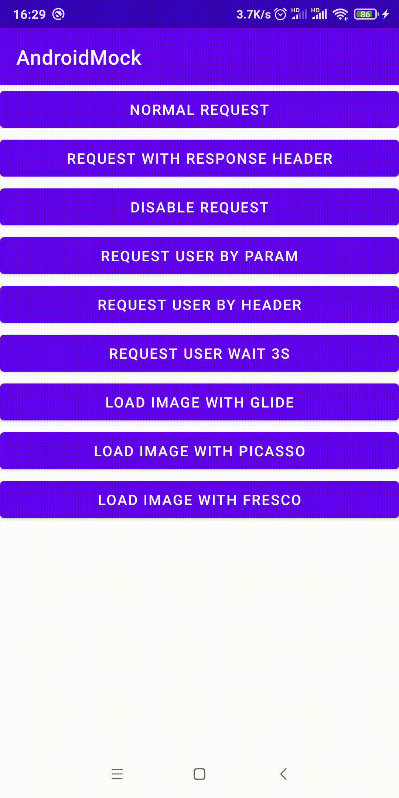
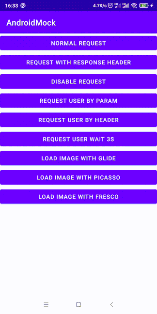

JYCAndroidOkhttpMock
======
Are you looking for a library that you can simulate the request api data locally? well today is your lucky day.

  

Last Version
--------
```
1.0.0
```

Usage
---------
```groovy
implementation "io.github.chinacoolder:jycandroidokhttpmock:${last_version}"
```
create path `app/src/debug/assets/jycmock/`
> **Warning: Please Don't Use Normal Assets Path To Store Your Mock Data**
>
> Normally you don't need mock data in your release build, so use debug assets is recommended

> **Warning: Undefined Resource Will Go With Default Request/Response**
>
> If target json file or image file don't exist or `enable` is false, request will keep go with default logic

Request Json Data
---------
add json file `user/1.json`
```json
{
  "content": {
    "name": "John",
    "age": 15,
    "male": true
  }
}
```
add interceptor to your `OkHttpClient`
```kotlin
OkHttpClient.Builder()
    .addInterceptor(JYCMockInterceptor(context))
    .build()
```
now everything is down, you can request data
```kotlin
data class User(
    val name: String,
    val age: Int,
    val male: Boolean
)
```
```kotlin
@GET("user/{userId}")
suspend fun getUser(@Path("userId") id: Long): User
```
```kotlin
userService.getUser(1)
```
the request will response your content data
```kotlin
User("John", 15, true)
```

Request Json By Param
---------
add `user.json`
```json
[
  {
    "config": {
      "filter": {
        "param": {
          "test": "1"
        }
      }
    },
    "content": {
      "name": "John1",
      "age": 18,
      "male": true
    }
  },
  {
    "config": {
      "filter": {
        "param": {
          "test": "2"
        }
      }
    },
    "content": {
      "name": "John2",
      "age": 16,
      "male": false
    }
  }
]
```
define retrofit
```kotlin
@GET("user")
suspend fun getUserWithParam(@Query("test") test: String): User
```
then
```kotlin
userService.getUserWithParam("1")
```
will response
```kotlin
User("John1", 18, true)
```
and
```kotlin
userService.getUserWithParam("2")
```
will response
```kotlin
User("John2", 16, false)
```

Complete Json Format
---------
```json
[
  {
    "config": {
      "wait": 1000,
      "enable": true,
      "filter": {
        "param": {
          "test": "1"
        },
        "header": {
          "test": "1"
        }
      }
    },
    "content": {
      "name": "John",
      "age": 15,
      "male": true
    }
  }
]
```
| Name   | Default | Remark                              |
|--------|---------|-------------------------------------|
| wait   | 0       | the request delay time, millisecond |
| enable | true    | is this json enable                 |
| param  | {}      | param filter                        |
| header | {}      | header filter                       |

Load Image
---------
add image file `images/sample.jpg`
```text
Note: image load only support file end with jpg,jpeg,png,webp(need to be lowercase)
```
```kotlin
Picasso.Builder(context)
    .downloader(
        OkHttp3Downloader(client)
    )
    .build()
    .load("https://www.google.com/images/sample")
    .into(image)
```

Interceptor Config
---------
```kotlin
class JYCMockInterceptor(
    context: Context,//application context
    path: String, //store mock data path, default is "jycmock"
    needMock: (Context, Request) -> Boolean
    //function that decide each request need to be mock
    //return true means this request need to be mock, otherwise return false
)
```

License
-------

```
Copyright JiaYiChi.

Licensed under the Apache License, Version 2.0 (the "License");
you may not use this file except in compliance with the License.
You may obtain a copy of the License at

   http://www.apache.org/licenses/LICENSE-2.0

Unless required by applicable law or agreed to in writing, software
distributed under the License is distributed on an "AS IS" BASIS,
WITHOUT WARRANTIES OR CONDITIONS OF ANY KIND, either express or implied.
See the License for the specific language governing permissions and
limitations under the License.
```